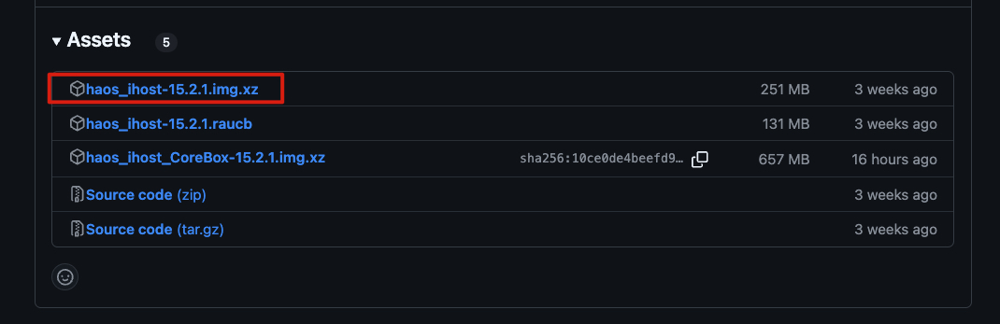

# HA over iHost README

[中文](README_CN.md)

**Home Assistant For SONOFF iHost**

## Prerequisites

- A SONOFF iHost is required. 
- Ensure your iHost system version is 2.5.1 or later.
- An (Application Class 2) (A2) card, with a minimum capacity of 32GB, is recommended for better performance, especially on small read&write operations.
- As iHost is based on a 32-bit processor, some Home Assistant features may not be compatible.

## Preparing the Micro SD Card

### Required Hardware

- An (Application Class 2) (A2) card, with a minimum capacity of 32GB, is recommended for better performance, especially on small read&write operations.
We would suggest using a TF card from SanDisk, Kingston, or Samsung. We have been internally using these brand cards for testing.
- An SD card reader: any standard USB card reader will work if your laptop doesn't have a built-in SD card reader.

### Required Software

- Micro SD card flash tool: [Balena Etcher](https://etcher.balena.io/) or [Raspberry Pi Imager](https://www.raspberrypi.com/software/), etc.
- Visit the GitHub project for the HA over iHost corresponding image: [iHost-Open-Source-Project](https://github.com/iHost-Open-Source-Project/ha-operating-system/releases).Only the HA over iHost image downloaded from this project is supported.

### **Flashing** HA Over iHost Image **to Micro SD Card**

Using Balena Etcher or Raspberry Pi Imager to flash the image is highly recommended.

#### Flash with *Balena Etcher*

1. Insert the Micro SD card into the card reader and connect it to your computer.
2. Download and run **Etcher**.

3. Click **Flash from file**, then select the  **HA over iHost** image file downloaded on your computer.

4. Click **Select target**, then choose the Micro SD card you inserted. 
   **Note: Please ensure you select the right drive!*

5. Click **Flash!** to start flashing the **HA over iHost** image onto the Micro SD card. 
   **Note: Do not remove or use the SD card during the flashing process.*

#### **Flash with** Raspberry Pi Imager

1. Insert the SD card into the card reader and connect it to your computer.
2. Download and run Raspberry Pi Imager.

3. Click **CHOOSE DEVICE > No filtering**.

4. Click **CHOOSE OS > Use custom**, then select the HA over iHost image file downloaded on your computer. 

5. Click **CHOOSE STORAGE**, then choose the Micro SD card you inserted. 
   **Note: Please ensure you select the right Micro SD card!*

6. Click **NEXT > NO, CLEAR SETTINGS**, and confirm to erase all settings on the SD card. 

7. Start flashing the HA over iHost image onto the inserted SD card. 
   **Note: Do not interact with the SD card (e.g., unplugging or modifying files) during the flashing process.*

## **Booting** Home Assistant Operating System on iHost

### Migrate Zigbee Devices (Optional)

*If Zigbee device migration is not needed, skip to the next section.*

iHost allows you to export and migrate iHost's Zigbee device data to Home Assistant by downloading the backup file available to restore in Home Assistant integrated with ZHA/Zigbee2MQTT. Only the Zigbee network and device status are migrated. Timers, groups, scenes, and device names are not included. [How to restore?](https://appcms.coolkit.cn/extra/26969.html)

### Booting Home Assistant Operating System on iHost

1. Insert the pre-flashed Micro SD card into the iHost SD Card slot.
2. Connect iHost to a network cable and power it on.
3. Within **5 seconds after powering on**, repeatedly press the **Mute** button (♪) on the top of the iHost until the **LED Side Strip** enters a **BLUE** breathing light pattern. This indicates that the system is switching to the Home Assistant OS flashed onto the SD card.

4. If the LED indicator shows a **BLUE** breathing light pattern, you can access your new Home Assistant web interface within the next 10 minutes. The first boot may take longer.
   On a desktop browser, enter [homeassistant.local:8123](http://homeassistant.local:8123/)*.* 

**Note:* 

- *If you are running an older version of Windows or have stricter network configurations, you may need to access Home Assistant using one of the following URLs: http://homeassistant:8123 or [http://X.X.X.X:8123](http://x.x.x.x:8123) *(replace X.X.X.X with the IP address of your iHost)*
- *isit the Supervisor interface (http://<HA_IP or HA_DOMAIN>:4357), a diagnostic tool, to check if the Supervisor has initialized properly during the booting process. It may take some time to download the required image. Once the Supervisor starts, Home Assistant Core will continue to boot. The system is usually accessible within about 1 minute under normal conditions, based on the test results.*  
- *If you still failed to access the Home Assistant interface after a long wait,  try pinging the iHost's IP address to check network connectivity.* 
- *To avoid unexpected shutdowns or booting issues, do not unplug the power directly. If iHost fails to boot properly, try to press and hold the top power button for 10 seconds to force shutdown, then press it once to reboot.* 

### **Troubleshooting Boot Failures**

- If the LED Side Strip does not show a **BLUE** breathing light pattern but a **RED** breathing light pattern after powering on for 5 seconds or after pressing the button multiple times, the boot has failed. Try re-booting the Home Assistant Operating System as follows:

1. Power cycle iHost.
2. No button press is needed.
3. iHost retries to boot Home Assistant Operating System from the SD card.

- If you cannot access Home Assistant web interface within 10 minutes after the operations above, it may be due to an incorrectly flashed image. Try re-flashing the SD card or using a new one.

### Switching Back to eWeLink CUBE 

- To switch back to eWeLink CUBE, follow these steps:
  1. Power cycle iHost.
  2. Repeatedly single-press the mute button (♪) within 3 seconds.
  3. The LED  Side Strip will switch to a **RED** flowing light pattern, confirming the system has switched back to eWeLink CUBE.

#### *Notes*:

- *If multiple devices are running Home Assistant Operating System on your network, the hostname [homeassistant.local] may not resolve correctly. You can discover the correct IP address via your router's management interface or by broadcasting mDNS service [_home-assistant._tcp.].*
- *If the last boot was from the SD Card, and the card is removed without switching back to eWeLink CUBE, the LED Side Strip will show a **RED** breathing light pattern, indicating Home Assistant Operating System has failed to boot on iHost.*

## **Hardware Resources**

Once Home Assistant Operating System is successfully running on iHost, you can use the following supported onboard hardwares:

### Button & LED indicator

The iHost Hardware Control add-on enables control of iHost's buttons and LED indicators in Home Assistant. It registers them as devices and separate entities, allowing users to use them in automations for more flexible hardware interactions(e.g., triggering the power button entity to power off iHost). For details, refer to the [iHost Hardware Control add-on](https://github.com/iHost-Open-Source-Project/hassio-ihost-addon) guide.

### Bluetooth

- **Chipset Model:** RTL8723DS
- **Path:** Settings > Devices & Services > Integrations > Bluetooth
- **Discovery:** Automatic

### Wi-Fi

- **Chipset Model:** RTL8723DS
- **Path:** Settings > System > Network > Configure Network Interfaces > WLAN0
- **Discovery:** Automatic

### Zigbee Coordinator

- **Chipset Model:** EFR32MG21A020F768IM32-B（RAM 64kB,Flash 768kB）
- **Path:** Settings > System > Hardware > All Hardware > /dev/ttyS4
- **Discovery:** Via Zigbee Home Automation (ZHA) or Zigbee2MQTT

## Supported Add-ons
- [iHost Hardware Control](https://github.com/iHost-Open-Source-Project/hassio-ihost-addon/blob/master/hassio-ihost-hardware-control/README.md)
- [SONOFF Dongle Flasher For iHost](https://github.com/iHost-Open-Source-Project/hassio-ihost-addon/blob/master/hassio-ihost-sonoff-dongle-flasher/README.md)
- [Matter Bridge for iHost](https://github.com/iHost-Open-Source-Project/hassio-ihost-addon/blob/master/hassio-ihost-matter-bridge-addon/README.md)
- [Node-RED](https://github.com/iHost-Open-Source-Project/hassio-ihost-addon/blob/master/hassio-ihost-node-red/README.md)
- [ESPHome Device Builder](https://github.com/iHost-Open-Source-Project/hassio-ihost-addon/blob/master/hassio-ihost-esphome/README.md)

## Upcoming Add-ons
- OpenThread Border Router
- Matter Server
- eWeLink Remote

## Acknowledgement

This project is a derivative development based on Darkxst's [[ha-operating-system\]](https://github.com/Darkxst/ha-operating-system) project from GitHub. We sincerely appreciate the original author for his foundational contributions.
