# HA over iHost README

[English](README.md)

**Home Assistant For SONOFF iHost**

## Home Assistant For SONOFF iHost

## 操作前必读

- 一台 iHost 且 iHost 系统版本需至少为 V2.5.1
- 建议使用[一个 Application Class 2](https://www.sdcard.org/developers/overview/application/index.html) 的 SD Card。检查卡上的标签 A2，A2 类卡的性能更好，尤其是在小型读写操作中，更适合主机应用程序，SD Card 存储空间至少 32 GB
- iHost 处理器为32位，无法下载和安装Home Assistant 中支持 64 位架构的 Add-on ，如：Node-RED 、Studio Code Server 等 Add-on 

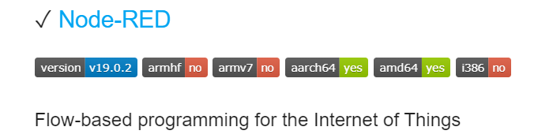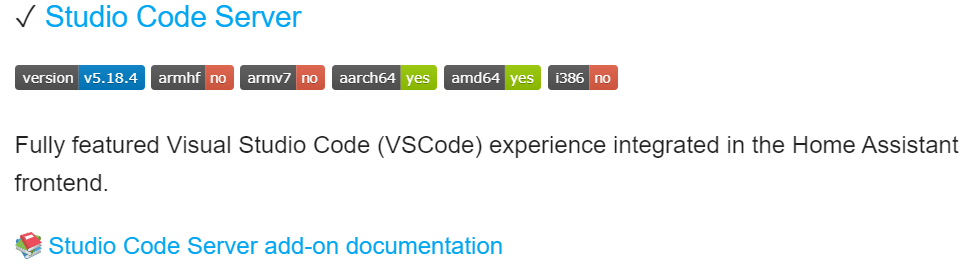

## SD Card 烧录

### 所需硬件

- iHost  一台
- 32GB 及以上 A2 SD Card 一张
- 读卡器一个：大多数笔记本电脑已带有该功能，但如果您没有独立的 USB 适配器，您可以购买[独立的 USB 读卡器](https://amzn.to/2WWxntY)。品牌无关紧要，只要选最便宜的就好。

### 所需软件

- SD Card 烧录工具：[Balena Etcher](https://etcher.balena.io/) 或 [Raspberry Pi Imager](https://www.raspberrypi.com/software/) 等 
- 可在 iHost 上运行的 Home Assistant， 访问 github项目：  [iHost-Open-Source-Porject](https://github.com/iHost-Open-Source-Project/ha-operating-system/releases)，下载最新的镜像文件.只有从  iHost-Open-Source-Porject 项目下载的HA镜像包才可以在iHost中使用

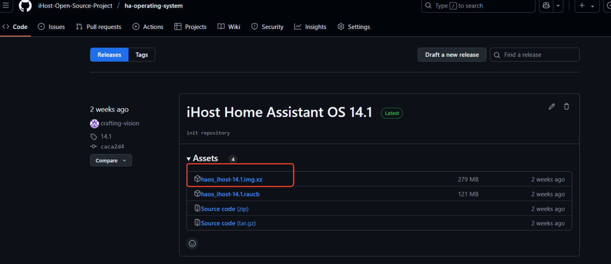

> 为了获得更快速、更可靠的首次安装体验 —— 尤其在无网络环境下，我们推荐使用 **CoreBox 镜像**。  
> 该镜像已预装完整的 Home Assistant Core（2025.05.03），系统启动时间可缩短至 3 分钟以内。  
> 详细说明请参见下方的 [CoreBox](#corebox) 部分。

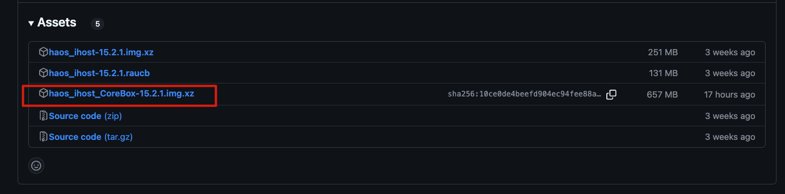

### 操作步骤

推荐使用 [Balena Etcher](https://etcher.balena.io/) 或 [Raspberry Pi Imager](https://www.raspberrypi.com/software/) 烧录镜像，二者选其一即可

#### Balena Etcher

- 将 SD Card 接入读卡器中，并插在电脑上(Windows/MacOS/Linux)
- 运行 Balena Etcher

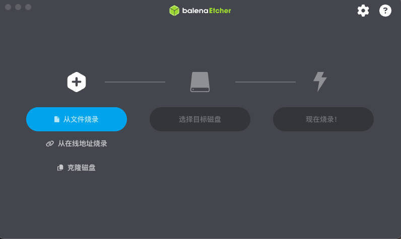

- "从文件烧录" -> 选择下载到本地的 HA over iHost 的镜像文件

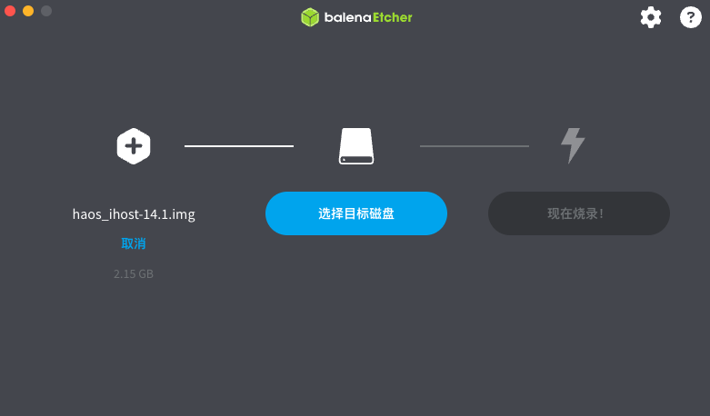

- "选择目标磁盘" -> 选择您所插入的 SD Card [!!!请注意不要选错磁盘!!!]

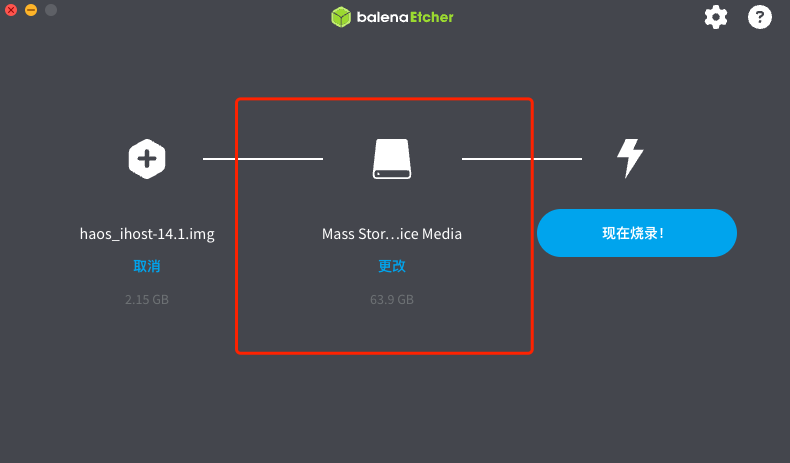

- 点击"现在烧录！"开始将下载的"HA over iHost"镜像文件烧录到 SD Card中，烧录过程中请不要操作 SD Card

#### Raspberry Pi Imager

- 将 SD Card 接入读卡器中，并插在电脑上(Windows/MacOS/Linux)
- 运行  Raspberry Pi Imager

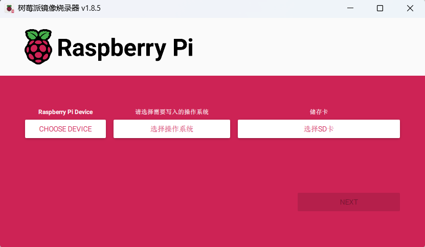

- "选择设备" -> 选择 No filtering

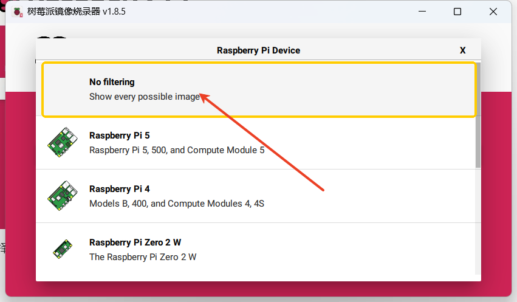

- "选择操作系统" -> 选择 Use custom> 选择下载到本地的 HA over iHost 的镜像文件

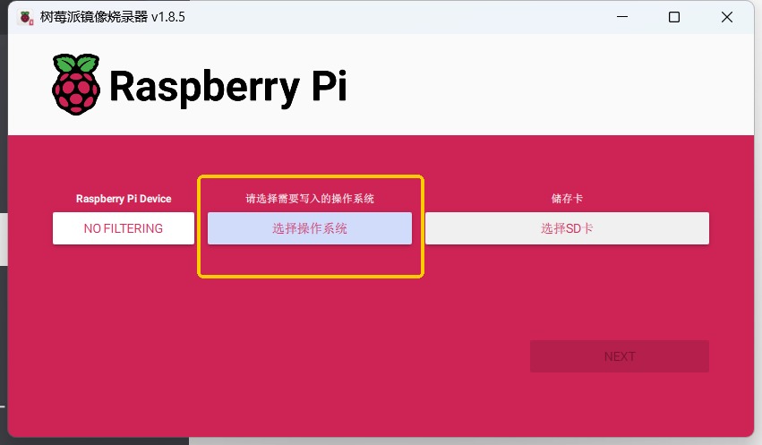

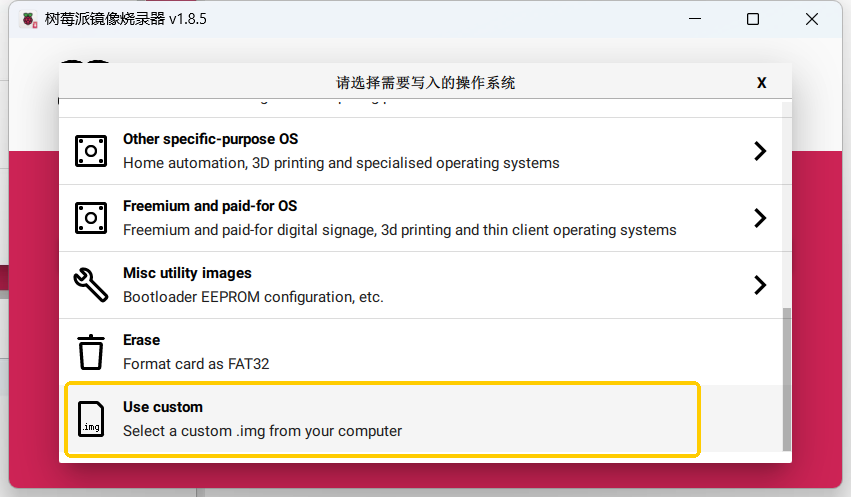

- "选择SD卡" -> 选择您所插入的 SD Card [!!!请注意不要选错磁盘!!!]

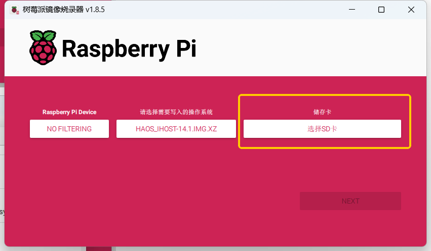

- 点击"NEXT"-> 允许清空SD卡的所有数据 

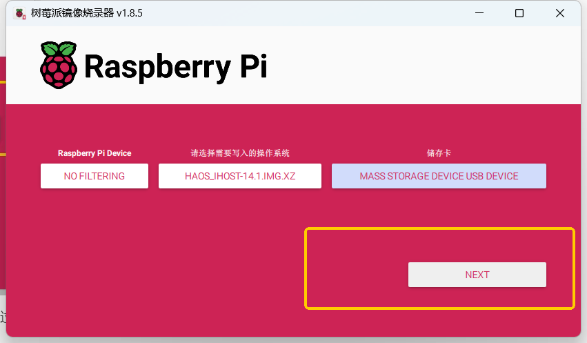

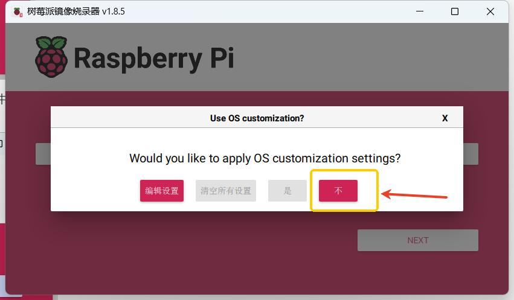

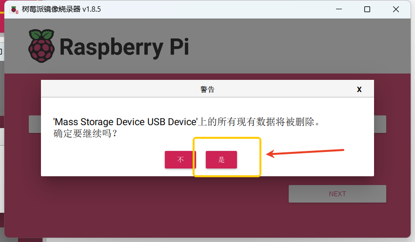

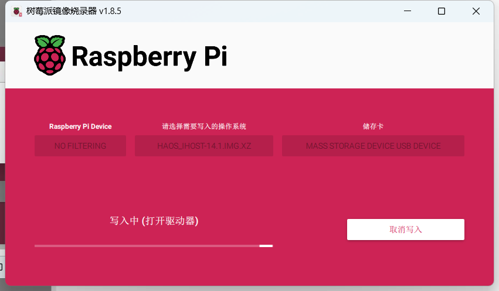

- 开始将下载的"HA over iHost"镜像文件烧录到 SD Card中，烧录过程中请不要操作 SD Card

## 在 iHost 中启动 Home Assistant

### (可选) Zigbee 设备迁移

 iHost 支持下载 Zigbee 设备备份文件到本地，可将已经在 iHost 中添加的Zigbee设备恢复到Home Assistant 的 ZHA 或 Zigbee2MQTT中。该功能仅迁移 Zigbee 网络和设备状态，关于在 iHost 上对 Zigbee 设备设置的定时器、群组、场景、设备名称都无法迁移，可查看 [操作指引](https://appcms.coolkit.cn/extra/26967.html)。

### 正常启动流程

- 待烧录完成后，取出 SD Card 并插入iHost SD Card 卡槽
- 给 iHost 连接网线并上电，在通电同时不断按下静音按键 ♪ ，直至 iHost 的灯条出现蓝色呼吸，系统将开始改变为 SD Card 卡上的 Home Assistant；

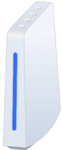

- 在看到蓝色呼吸灯的十分钟内，您将能够访问您的新 Home Assistant，第一次启动需要的时间会长一点

- 在桌面系统的浏览器中，输入 [homeassistant.local：8123](http://homeassistant.local:8123/)

  *注意*：
  - *如果您运行的是较旧的 Windows 版本或具有更严格的网络配置，则可能需要在 [homeassistant：8123](http://homeassistant:8123/) 或 `http://X.X.X.X:8123` 访问 Home Assistant（请将 X.X.X.X 替换为您的 iHost 的 IP 地址）*
  - *在启动过程中可使用 http://<HA_IP or HA_DOMAIN>:4357（这是 Supervisor 的诊断接口）， 确认 Supervisor 是否有起来，因为在 Supervisor 启动过程中会去拉取一些镜像，这需要一点时间； 当确认Supervisor启动成功后，HA core 还需要一定时间启动，按照我们实测正常情况大约1分钟左右能进入，这可以作为一个参考值。*
  - *等待很长时间没有访问成功，你可以通过 ping iHost 的 ip 来检查*
  - *在整个使用过程中为了避免出现未知问题，导致系统无法正常启动，切勿随意断开电源。 你可以通过长按（按住不放等待10s）iHost 顶部的电源按键来关闭 iHost , 在关机的状态下单击电源按键来开启 iHost*

### 启动失败

- 如果 10分钟内没有正常访问，则可能是图像写入不正确，请尝试再次刷写 SD 卡，甚至可能尝试不同的 SD 卡。
- 若在通电5秒后未看到蓝色呼吸灯即进入失败（指示灯显示红色呼吸），您需要再次断电重启来尝试从SD Card卡启动Home assistant

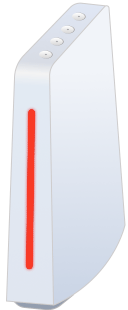

此时您不需要单击静音按键，因为 iHost 会记住您上一次是从TF卡启动 Home assisatnt，在您断电重启后会自动尝试从SD Card卡启动 Home assistant 。

### 切换回 eWeLink CUBE

- 若需要切换回 eWeLink CUBE，重复此通电及按键操作（在通电后3s内不断按下静音按键）即可，切换 eWeLink-CUBE 系统成功后，灯条灯效从蓝色呼吸改为红色跑马灯

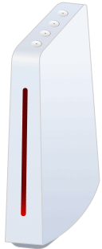

注:

- 若您的局域网中有超过一台运行 HomeAssistant 设备，则无法通过 homeassistant.local 域名进行访问，需通过路由器后台或 mDNS 广播[_home-assistant._tcp.]查找 IP 地址
- 若您的 iHost 上次启动为 SD Card，当您移除 SD Card 且没有切换为 eWeLink CUBE 系统时，灯条灯效将表现为红色呼吸

## CoreBox

CoreBox 是一款为 SONOFF iHost 快速启动 Home Assistant 而设计的镜像版本，内置了最新版的 Home Assistant Core（2025.05.03）。

使用 CoreBox，无需在首次安装时等待设备从 GitHub 下载 HA Core。系统将直接从内置版本启动，3 分钟内即可完成启动过程。CoreBox 彻底摆脱了对网络连接的依赖，即使在离线环境中也能完成安装。系统启动后，你仍然可以通过正常方式升级到更新的 HA Core 版本。

### 为什么选择 CoreBox？

我们始终在倾听用户的声音。许多用户反馈，在首次安装 HA over iHost 的过程中，由于网络不稳定，尤其是在下载 HA Core 阶段，容易导致安装失败或等待时间过长。这种体验令人沮丧，也使不少首次尝试的用户感到挫败。

即使我们提供在线支持，排查网络问题并指导安装流程也经常需要耗费较长时间，增加了用户和支持团队的负担。

因此，我们推出了 CoreBox —— 一个真正从用户体验出发的解决方案。

使用 CoreBox，你将获得：
	•	快速且可靠的安装体验
	•	避免因网络问题导致的延迟或失败
	•	更加安心稳定的 Home Assistant 启动体验，无论何时何地

### 内置的 HA Core 可以更新吗？—— 可以！

当系统通过内置版本（2025.05.03）启动后，Home Assistant 会自动检测是否有更新版本可用。
你可以像正常安装一样，通过「设置 > 系统 > 更新」页面完成 HA Core 的升级。

## 硬件资源

在 iHost 上成功启动 Home Assistant 后，您可以在 Home Assistant 中使用 iHost 提供的硬件资源。

- 按键及指示灯

  可通过在Home Assistant 安装运行 "iHost Hardware Control"add-on 来控制 iHost 机身上的按键和指示灯效果，该 add-on 会将按键和指示灯分别注册为设备和不同的实体，可利用Home Assistant 中的自动化来控制按键和指示灯的不同效果，可查看[使用教程](https://github.com/iHost-Open-Source-Project/hassio-ihost-addon)

  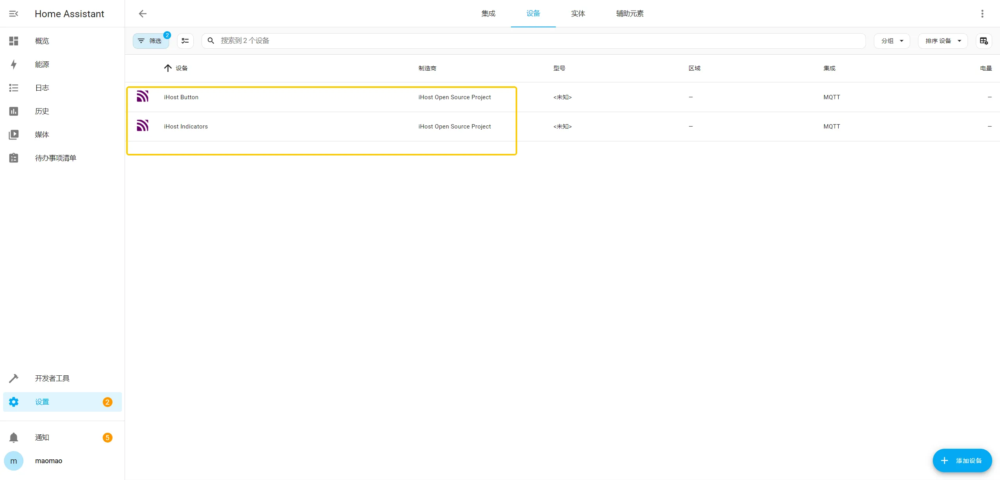

- 蓝牙 

- - 型号:RTL8723DS 
  - 相关信息:设置->设备与服务->已配置->Bluetooth
  - 识别方式:自动

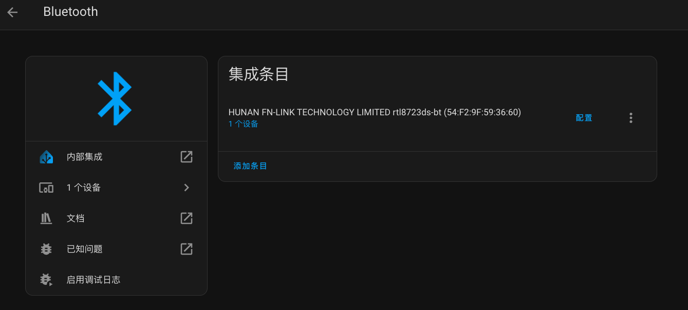

- WiFi  

- - 型号:RTL8723DS
  - 相关信息:设置->系统->网络->配置网络接口->WLAN0
  - 识别方式:自动

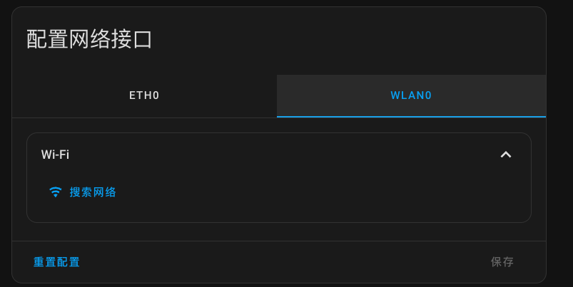

- Zigbee 协调器

- - 型号: EFR32MG21A020F768IM32-B（RAM 64kB,Flash 768kB）
  - 相关信息:设置->系统->硬件->全部硬件->/dev/ttyS4
  - 识别方式:使用ZHA或者Z2M

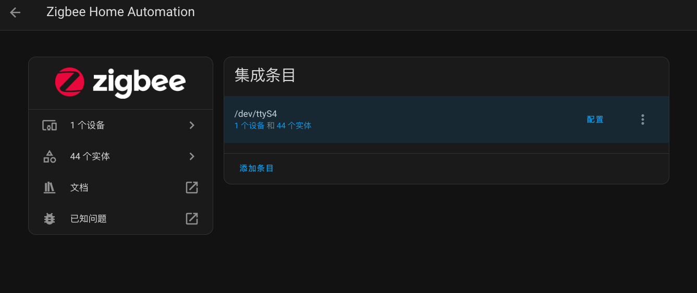

## 计划中

- 扬声器
- 麦克风
- Matter Bridge Addon 
- eWeLink Smart Home Addon

## 已支持 Add-ons
- [iHost Hardware Control](https://github.com/iHost-Open-Source-Project/hassio-ihost-addon/blob/master/hassio-ihost-hardware-control/README.md)
- [SONOFF Dongle Flasher For iHost](https://github.com/iHost-Open-Source-Project/hassio-ihost-addon/blob/master/hassio-ihost-sonoff-dongle-flasher/README.md)
- [Matter Bridge for iHost](https://github.com/iHost-Open-Source-Project/hassio-ihost-addon/blob/master/hassio-ihost-matter-bridge-addon/README.md)
- [Node-RED](https://github.com/iHost-Open-Source-Project/hassio-ihost-addon/blob/master/hassio-ihost-node-red/README.md)
- [ESPHome Device Builder](https://github.com/iHost-Open-Source-Project/hassio-ihost-addon/blob/master/hassio-ihost-esphome/README.md)
- [eWeLink-Remote](https://github.com/iHost-Open-Source-Project/hassio-ihost-addon/blob/master/hassio-ihost-ewelink-remote/README.md)
- [Matter Server](https://github.com/iHost-Open-Source-Project/hassio-ihost-addon/blob/master/hassio-ihost-matter-server/README.md)

## 即将支持 Add-ons
- OpenThread Border Router

## 感谢

在此感谢 Darkxst ，该项目基于Darkxst 在github 上的 ha-operating-system 项目二次开发
